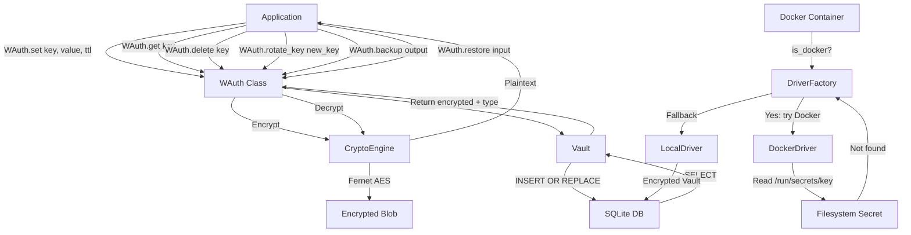
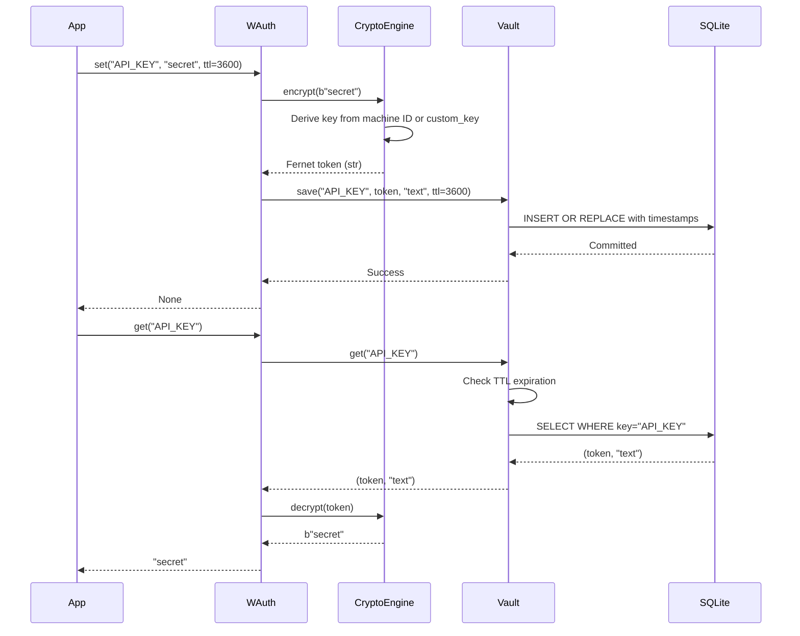

# WAuth — Machine-Locked Encrypted Secret Management

[](https://pypi.org/project/wpipe/)
[](https://pypi.org/project/wpipe/)
[](#)
[](#)
[](LICENSE)
[](VERSIONING.md)

> **Store, rotate, back up, and retrieve secrets encrypted with Fernet (AES-256), backed by SQLite — tied to the machine they were created on.**

---

## Key Features

- **Fernet Encryption** — AES-128-CBC via the `cryptography` library, with a 32-byte machine-derived key (SHA-256 of salted machine ID).
- **SQLite-Backed Persistence** — Secrets stored in a local SQLite database via `wsqlite`, with automatic directory creation.
- **Docker Secret Support** — Read Docker Swarm/Compose secrets from `/run/secrets` when running inside containers.
- **Dual Driver Architecture** — Factory pattern automatically selects between local encrypted vault and Docker secrets based on runtime environment.
- **File & Text Support** — Store both plaintext secrets and encrypted files (`.pem`, `.key`, certificates).
- **Key Rotation** — Rotate encryption keys with automatic re-encryption of all secrets via `rotate_key()`.
- **TTL Support** — Set time-to-live on secrets for automatic expiration.
- **Backup & Restore** — Export and import encrypted vault snapshots.
- **Async Support** — `async_set()`, `async_get()`, `async_delete()`, `async_backup()`, `async_restore()` for async workflows.
- **Custom Exceptions** — Structured exception hierarchy (`DecryptionError`, `KeyNotFoundError`, `VaultError`, etc.).
- **Structured Logging** — Full `loguru` integration for diagnostics.
- **Configuration File** — TOML-based configuration support.
- **Pydantic Validation** — All secret models validated with Pydantic v2 for type safety.
- **Code Quality** — Pylint score ≥ 9.5 across all modules, 98% test coverage, Google Style Docstrings, full type hints.
- **Security Audited** — Bandit scan with 0 medium/high findings. [See SECURITY.md](SECURITY.md)

## Technical Stack

| Layer | Technology |
|-------|-----------|
| **Language** | Python 3.9+ |
| **Encryption** | Fernet (AES-128-CBC) via `cryptography` |
| **Storage** | SQLite via `wsqlite` (ORM-backed by Pydantic) |
| **Testing** | pytest, pytest-cov |
| **Linting** | Pylint, Ruff, Black, MyPy |
| **Logging** | loguru |
| **Documentation** | Sphinx (furo theme), reStructuredText |
| **CI/CD** | GitHub Actions (lint, test, security, publish) |

## Installation & Setup

### From PyPI

```bash
pip install wpipe
```

### From Source

```bash
git clone https://github.com/wisrovi/wpipe.git
cd wpipe
python -m venv .venv && source .venv/bin/activate
pip install -e ".[dev,docs]"
```

### Dependencies

```
Runtime:
  cryptography    — Fernet encryption
  wsqlite         — SQLite ORM with Pydantic integration
  pydantic        — Data validation and serialization
  loguru          — Structured logging

Development:
  pytest          — Testing framework
  pytest-cov      — Coverage reporting
  black           — Code formatting
  ruff            — Fast linter
  mypy            — Static type checking

Documentation:
  sphinx          — Documentation generator
  furo            — Modern Sphinx theme
  sphinx-copybutton  — Copy code blocks
  myst-parser     — Markdown support
```

## Architecture & Workflow

### Directory Structure

```
wauth/
├── __init__.py          # WAuth class, functional API, async methods
├── core.py              # CryptoEngine — Fernet encryption/decryption
├── vault.py             # SecretModel (Pydantic) + Vault (SQLite + TTL)
├── utils.py             # Machine ID detection & key derivation
├── exceptions.py        # Custom exception hierarchy
├── deprecation.py       # @deprecated decorator & warn_deprecated()
├── drivers/
│   ├── __init__.py      # DriverFactory — auto-selects local or Docker
│   ├── local.py         # LocalDriver — encrypted local + rotation
│   └── docker.py        # DockerDriver — reads /run/secrets
├── test/
│   ├── conftest.py              # Shared fixtures
│   ├── test_core.py             # CryptoEngine (13 tests)
│   ├── test_vault.py            # Vault & SecretModel (22 tests)
│   ├── test_utils.py            # Utility functions (10 tests)
│   ├── test_drivers.py          # Driver tests (17 tests)
│   ├── test_wauth.py            # WAuth & API (30 tests)
│   ├── test_exceptions.py       # Exception hierarchy (10 tests)
│   └── test_deprecation.py      # Deprecation utilities (7 tests)
├── benchmarks/
│   └── performance.py   # Performance benchmark suite
├── examples/
│   └── 00 base/
│       └── example.py   # Basic usage example
├── docs/                # Sphinx documentation
├── README.md            # This file
├── SECURITY.md          # Security policy & threat model
├── VERSIONING.md        # SemVer & LTS policy
├── MIGRATION.md         # Migration guides between versions
├── PYLINT_REPORT.md     # Static analysis quality report
└── pyproject.toml       # Build configuration, dependencies
```

### System Workflow



### Encryption Flow



## Configuration

### Environment Variables

| Variable | Description | Default |
|----------|-------------|---------|
| `WAUTH_DB_PATH` | Custom SQLite database path | `~/.wisrovi/wauth.db` |

### TOML Configuration File

Create `~/.wauth.toml`:

```toml
[wauth]
db_path = "~/.wisrovi/wauth.db"
custom_key = "my-encryption-key"  # Optional
```

Usage:
```python
from wauth import WAuth
auth = WAuth(config_path="~/.wauth.toml")
```

### Database Path

By default, WAuth stores secrets in `~/.wisrovi/wauth.db`. To use a custom path:

```python
from wauth import WAuth

# Custom database path
auth = WAuth(db_path="/path/to/my_secrets.db")
auth.set("MY_KEY", "my-secret")
```

### Important Security Note

Encryption keys are **derived from the machine's unique identifier**. This means:

- Secrets encrypted on **Machine A** **cannot** be decrypted on **Machine B**.
- This is intentional — it prevents accidental secret leakage across environments.
- For cross-machine secret sharing, use Docker secrets, environment variables, or the `custom_key` parameter.

## Usage

### Quick Start

```python
from wauth import WAuth

# Initialize
auth = WAuth()

# Store a secret (automatically encrypted)
auth.set("TELEGRAM_TOKEN", "7483920:ABC-DEF-GHI")

# Retrieve the secret (auto-decrypted)
token = auth.get("TELEGRAM_TOKEN")
print(token)  # 7483920:ABC-DEF-GHI
```

### Storing Files

```python
from wauth import WAuth

auth = WAuth()

# Encrypt and store a file (e.g., TLS certificate)
auth.set_file("TLS_CERT", "/etc/ssl/certs/my-cert.pem")

# Retrieve the file contents as bytes
cert_bytes = auth.get("TLS_CERT")
with open("/tmp/restored-cert.pem", "wb") as f:
    f.write(cert_bytes)
```

### Functional API

```python
from wauth import set, get, set_file, delete, list_keys

# No need to instantiate WAuth
set("API_KEY", "sk-12345")
value = get("API_KEY")

# Store a file
set_file("SSH_KEY", "~/.ssh/id_rsa")
key_data = get("SSH_KEY")

# Delete a secret
delete("OLD_KEY")

# List all keys
keys = list_keys()
```

### Delete Secrets

```python
from wauth import WAuth

auth = WAuth()
auth.set("TEMP_TOKEN", "expires-soon")
auth.delete("TEMP_TOKEN")  # Permanently removes the secret
```

### Time-To-Live (TTL)

```python
from wauth import WAuth

auth = WAuth()

# Secret expires after 1 hour (3600 seconds)
auth.set("SESSION_TOKEN", "abc123", ttl=3600)

# After 1 hour, get() returns None
```

### Key Rotation

```python
from wauth import WAuth

auth = WAuth()
auth.set("KEY1", "value1")
auth.set("KEY2", "value2")

# Rotate the encryption key — all secrets are re-encrypted
results = auth.rotate_key("new-encryption-key")
# {"KEY1": True, "KEY2": True}
```

### Backup & Restore

```python
from wauth import WAuth

auth = WAuth()
auth.set("IMPORTANT", "critical-data")

# Export all secrets (still encrypted in the backup)
backup_path = auth.backup("my_vault_backup.wauth")

# Later, or on another machine with the same key
count = auth.restore("my_vault_backup.wauth")
print(f"Restored {count} secrets")
```

### Docker Integration

```python
from wauth import WAuth
from wauth.drivers import DriverFactory

# In a Docker container, DriverFactory tries Docker secrets first
factory = DriverFactory()
value = factory.get_value("DB_PASSWORD")
# Returns Docker secret if available, falls back to local vault
```

### Async Support

```python
import asyncio
from wauth import WAuth

async def main():
    auth = WAuth()
    await auth.async_set("ASYNC_KEY", "async-value")
    value = await auth.async_get("ASYNC_KEY")
    await auth.async_delete("ASYNC_KEY")
    print(value)  # async-value

asyncio.run(main())
```

### Exception Handling

```python
from wauth import WAuth
from wauth.exceptions import DecryptionError, KeyNotFoundError, WAuthError

auth = WAuth(custom_key="my-key")

try:
    value = auth.get("MISSING")
except KeyNotFoundError:
    print("Key does not exist")

try:
    # Decrypting with wrong key raises DecryptionError
    auth._driver.engine.decrypt("invalid-token")
except DecryptionError:
    print("Wrong key or corrupted data")

# Catch any WAuth error
try:
    auth.delete("MISSING")
except WAuthError:
    print("Any WAuth-related error")
```

### Running the Example

```bash
python "examples/00 base/example.py"
# Output: Retrieved token: 7483920:ABC-DEF-GHI valid
#         Retrieved token with custom key: 7483920:ABC-DEF-GHI valid
```

## Testing & Quality

```bash
# Run tests with coverage
make test          # pytest with coverage report

# Lint all code
make lint-all      # Pylint on source and tests

# Run benchmarks
python benchmarks/performance.py

# Full quality check
make quality       # lint + test + format check
```

### Quality Metrics

| Metric | Score | Target |
|--------|-------|--------|
| **Pylint (wauth/)** | 9.95/10 | ≥ 9.5 |
| **Pylint (test/)** | 9.89/10 | ≥ 9.5 |
| **Test Coverage** | 98% | ≥ 95% |
| **Tests** | 117 passing | 100% |
| **Bandit Security** | 0 medium/high | 0 |

### LTS Status

WAuth v1.6.0 is an **LTS (Long Term Support)** release:

- 24 months of security backports
- Stable public API with deprecation guarantees
- SemVer-compliant versioning
- [See VERSIONING.md](VERSIONING.md)
- [See MIGRATION.md](MIGRATION.md)
- [See SECURITY.md](SECURITY.md)

## Documentation

```bash
make html    # Build Sphinx docs
make serve   # Preview docs locally
```

Full API reference is available at `docs/_build/html/index.html`.

## Author

**William Rodríguez — wisrovi**  
*Technology Evangelist & Open Source Advocate*

🔗 [LinkedIn](https://es.linkedin.com/in/wisrovi-rodriguez)  
🐙 [GitHub](https://github.com/wisrovi)

---

*WAuth is designed for developers who need simple, secure, machine-locked secret storage. Perfect for local development environments, CI/CD pipelines, and single-node deployments. LTS since v1.6.0.*
